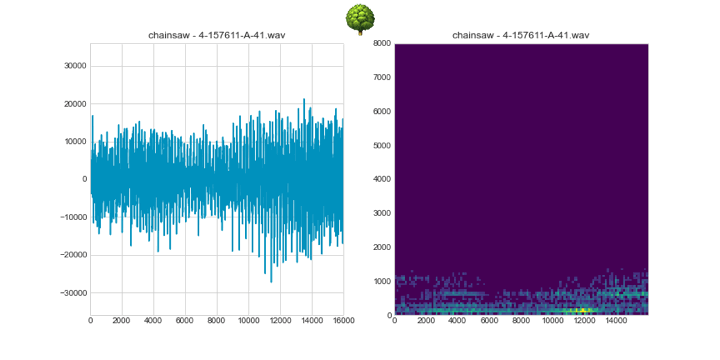

# Fixed-point DSP for Data Scientists

Jupyter Notebook and assets to accompany the ["Fixed-point DSP for Data Scientists" Towards Data Science blog post](https://towardsdatascience.com/fixed-point-dsp-for-data-scientists-d773a4271f7f) by [Sandeep Mistry](https://github.com/sandeepmistry) and [Henri Woodcock](https://github.com/henriwoodcock).

## License

[Apache-2.0 License](LICENSE)

---

Disclaimer: This is not an official Arm product.

